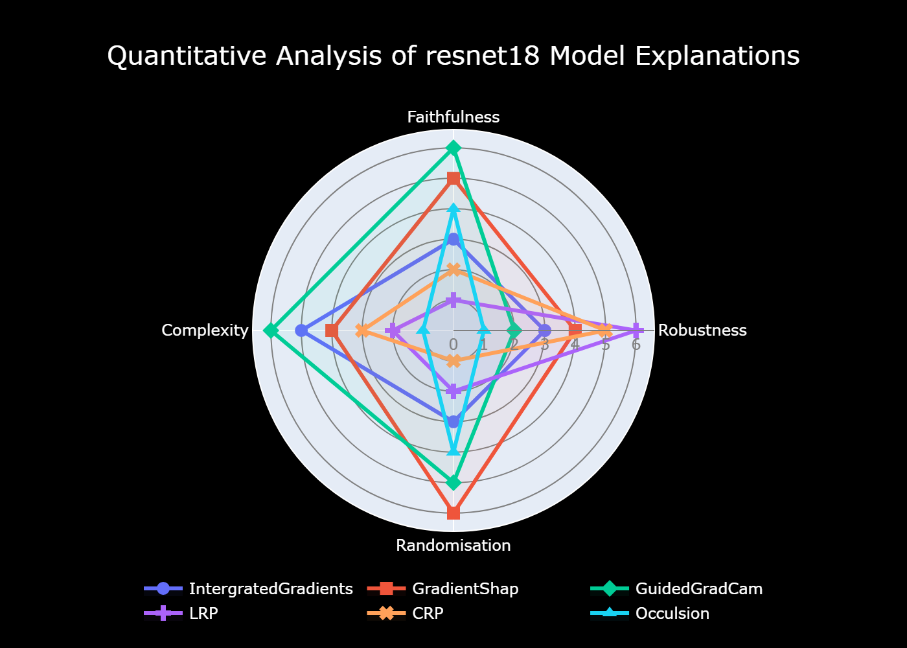

# Leveraging Concept Relevance Propagation to Understand The Natural Areas in Satellite Imagery
## Master's Thesis: CMS
TU Bergakademie Freiberg and Rheinische Friedrich-Wilhelms Universitat Bonn


## Installation

Follow these steps to set up your environment to run the code from this repository.

### Prerequisites

- Python (recommended version 3.8 or higher)
- pip (latest version)

### Setup Environment

1. Clone the repository to your local machine:
   ```bash
   git clone https://github.com/viswambhar-yasa/ExplainingWilderness.git
   cd ExplainingWilderness
    ```
2. Create a virtual environment to keep dependencies required by different projects separate. Execute the following command in your terminal:
    ```bash
    python -m venv venv
    ```
3. Activate the virtual environment:
    ```bash
    venv\Scripts\activate
    ```
4. Install the required packages by running
    ```bash
    pip install -r requirements.txt
    ```

**Background:**
Untouched natural areas, such as wild and protected regions, play a crucial role as vital ecosystems, supporting various species and essential ecological processes. Their preservation is critical for maintaining biodiversity, mitigating climate change impacts, and the well-being of future generations.


**Challenge:**
While satellite imagery and machine learning contribute to monitoring efforts, comprehending the characteristics of these areas remains challenging. In this context, explainable machine learning methods offer a promising approach to interpret these traits and uncover the underlying geo-ecological patterns.


**Problem Statement:**
Commonly used explainable machine learning methods often fall short of providing valid explanations for the spatial and spectral patterns observed in protected regions.

**Objective:**
This thesis aims to investigate the potential of concept relevance propagation and relevance maximization techniques in explaining the natural authenticity of protected natural areas.


**Methodology:**
This research will involve developing and implementing the necessary models and methods to apply these techniques effectively for to identify concept by relevance maximization an perform concept disentanglement. 


**Global Reference:**
Also generate global reference image from which the channel was able to identify or learn the feature.


**Evaluation:**
A crucial aspect of this thesis will be the evaluation of the explanations generated by these techniques and their comparison to state-of-the-art explainable machine learning methods.



**Sensitivity Analysis**
Performing randomization of layer weights
<p float="left">
  
   
</p>

**Notebooks and python file to perform the above operations are given in experiment folder**